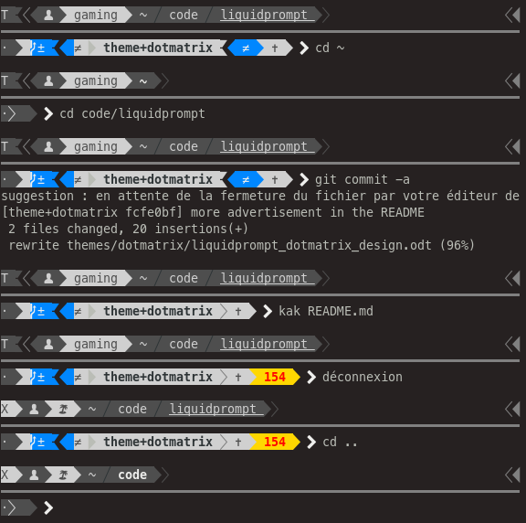

.. Liquidprompt documentation master file, created by
   sphinx-quickstart on Wed Nov 18 11:00:53 2020.
   You can adapt this file completely to your liking, but it should at least
   contain the root `toctree` directive.

Welcome to Liquidprompt's documentation!
========================================

Liquidprompt is an adaptive prompt for Bash & Zsh that gives you a nicely
displayed prompt with useful information when you need it. It does this with a
powerful theming engine and a large array of data sources.

To get started, view the :doc:`install` documentation, which includes
instructions for trying Liquidprompt temporarily.

On top of the classical information of a classical prompt,
Liquid Prompt displays the state of many of the tools that you like to operate
from the command line, for example:

* numerous information from various version control systems (Git, Mercurial, Fossil, etc.), when you are in a code repository;
* whether you're remotely connected by SSH, in a terminal multiplexer (screen or tmux), with graphical support;
* permissions on the current directory, whether you have sudo rights or not;
* information about virtual environments, web proxy;
* information about jobs attached to the current terminal;
* alerts about the battery or the load;
* etc., etc., etc.

Liquid Prompt has been carrefuly designed to highlight the *relevant*
information, at *the right time*.
It does not clutter your prompt with useless eye candy and helps you detect
important alerts right away.
Moreover, Liquid Prompt is highly configurable: you can disable useless features
and change any alert thresholds to suit your needs.
On top of this, it comes with several themes, from the discrete default to the
most colorful and fancy one.

.. toctree::
   :maxdepth: 2
   :caption: Contents:

   install
   config
   theme
   functions
   release-notes
   upgrading

Indices and tables
==================

* :ref:`genindex`
* :ref:`search`

Screenshots
===========

:doc:`theme/default` (classical design):

.. image:: demo.png

:doc:`theme/included/powerline` (fancy colors):

.. image:: demo_powerline.png

:doc:`theme/included/dotmatrix` (polished UX):

