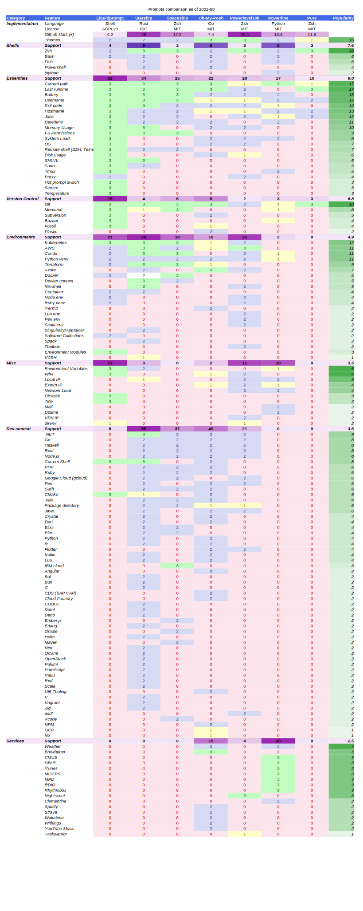

Why Liquid Prompt?
==================

Liquid Prompt gives you a **carefully designed prompt** with useful information.
It shows you what you need when you need it.
You will notice what changes *when* it changes, saving time and frustration.
You can even use it with your favorite shell – Bash or zsh.

Screenshot examples
-------------------

Because Liquid Prompt only shows the important information, each screenshot
below actually shows three prompts:

- a "short" one, which is what you will see most of the time,
- a "medium" prompt, which is close to what you would see while working,
- a "long" prompt, showing a large part of what Liquid Prompt can display,
  keeping in mind that seeing as much information at the same time is a rare
  event in practice.

.. note:: You can click on the images to see them at full resolution.

The default theme is using 16 colors, which is guaranteed to work in any
terminal, on dark or light background, even for (mildly) colorblind people.

Note that the actual colors are depending on your terminal emulator
configuration and may not look the same than in the following screenshot:

You may load config files altering only a part of the display, like the colors
and the icons. For instance, here is the default theme, using two of such
"presets": ``256-colors-dark.conf`` and ``more-unicode.conf``:

And here is the default theme using ``256-colors-light.conf`` and
``nerd-font.conf``:

The Unfold theme, very similar to the default theme,
but spread on two lines and a right-aligned section:

The Powerline themes are provided in
`a side project <https://github.com/liquidprompt/liquidprompt-powerline>`_.

Here is its ``power2lines`` version, which is spread on two lines:

and the ``powerpuff`` version, which uses three lines, with right-aligned
sections as well:

.. note:: There are many more themes! See the
   `wiki page dedicated to third party themes <https://github.com/liquidprompt/liquidprompt/wiki/Themes>`_.

Killer Features
---------------

There are many prompts configurations out there, but here is what makes Liquid
Prompt stand out:

- **UX Design**: Liquid Prompt was very carefully design from the beginning, to
  allow for the best user experience. That is, it displays *meaningful*
  information with *minimal visual clutter* and *maximum readability*. While
  most of the other prompts are focused on aligning as much colored "segments"
  as possible on top of each others to look fancy, Liquid Prompt focus on what
  really matters.
- **Ease of use**: Liquid Prompt is written in (*heavily optimized*) portable
  Shell, and its installation is as easy as copying files. It also provides
  pre-defined themes, enabled by a simple command in your shell configuration.
  Configuration is as simple as editing text files with key/value pairs. No
  complex format to learn.
- **Shell features first**: Liquid Prompt helps you being aware of all the
  powerful features a modern shell can provide. While most other prompts focus
  on covering a lot of (boring) software version tags, Liquid Prompt shows you
  the features that are actually useful while you actually use the shell.
- **Configurability**: All aspects of Liquid Prompt are configurable, down to
  the core.

Features overview
=================

Liquid Prompt has good support of shell-related features, various version
control systems, and several software configuration environments.

To browse the complete list of capabilities, see :doc:`config`.

Shell Essentials
----------------

These are some of the most popular features:

- **Current path**: displays where you are, highlighting the important parts
  (current directory, version control repository root), smart path shortening.
- **Last command execution time**: if the last executed command took too long,
  display how much time it took.
- **Battery level**: show what charge remains in the battery if it's close
  enough to empty.
- **Username**: display the user name if it's not the login one.
- **Hostname**: indicate the hostname if over a remote connection, with
  host-specific color.
- **Exit code**: display the last command's exit code if it was an error.
- **Jobs**: show counters for background, sleeping, and detached jobs.
- **Time**: display the current time, using clock icons if you want a compact
  view.
- **Memory**: display the available memory, if not enough RAM remains.
- **Filesystem permission**: indicate if the current directory is writable or
  not.
- **System load**: warn if the load is too high.
- **Remote shell**: discreetly denote if you are connected through SSH, under
  Tmux and with X Forwarding capability.
- **Disk**: display the free disk space if it is too small.
- **Shell level**: displays the number of nested shells if it starts being too
  much.
- **Sudo**: show if the user currently has *sudo* rights.
- **Multiplexers**: indicate if you are in a terminal multiplexer session
  (i.e. tmux or screen).
- **Proxy**: indicate whether a proxy is configured.
- **Temperature**: warn if the temperature goes too high.
- **Hot prompt switch**: commands allowing you to rapidly switch the theme,
  go back to the default prompt, or even the most simple prompt possible.
- **Wifi**: shows the wireless network signal strength.
- **Dir stack**: helps you follow the state of this overlooked, but neat,
  feature of modern shells.
- **Title**: synchronize the prompt and the terminal's window title (or status
  bar).

Version Control
---------------

Liquid Prompt has one of the most comprehensive supports for source code
management systems living in the shell. It has near-to-complete support for:

- **Git**,
- **Mercurial**,
- **Subversion**,
- **Fossil**,
- **Bazaar**.

It shows the current branch/tags, its state, and several statistics on the
current commits/edits.

Software Configuration Environments
-----------------------------------

Modern development environments love to use abstractions on top of software
packages. Liquid Prompt helps you knowing which one is currently in use where
you are:

- **AWS**,
- **Conda**,
- **Python venv**,
- **Kubernetes**,
- **Terraform**,
- **Docker**,
- **Container**,
- **Node env**,
- **Ruby venv**,
- **Software Collections**,
- **CMake**.

Those show up only if you enter a configured directory, or have configured
environment variables.

Features Disabled by Default
----------------------------

Some features are disabled by default,
generally because they are expected to be rarely used
or to not behave consistently on *all* systems.

You may want to enable those features,
by setting the following configuration variables to **1**
in your configuration file(s)
(see the :doc:`config` section to find out how to do it).

Shell essentials:

- :attr:`LP_ENABLE_DIRSTACK`
- :attr:`LP_HOSTNAME_ALWAYS`
- :attr:`LP_ENABLE_RUNTIME_BELL`
- :attr:`LP_ENABLE_SSH_COLORS`
- :attr:`LP_ENABLE_SUDO` (double-check with your sysadmin if you can enable
  that)
- :attr:`LP_ENABLE_DISK`
- :attr:`LP_ENABLE_ERROR_MEANING`
- :attr:`LP_ENABLE_ERROR_MEANING_EXTENDED`

Operating System:

- :attr:`LP_ENABLE_OS`
- :attr:`LP_ENABLE_OS_ARCH`
- :attr:`LP_ENABLE_OS_FAMILY`
- :attr:`LP_ENABLE_OS_DISTRIB`

Development/environments:

- :attr:`LP_ENABLE_VCS_REMOTE`
- :attr:`LP_ENV_VARS` is empty by default
  (but :attr:`LP_ENABLE_ENV_VARS` is enabled).
- :attr:`LP_ENABLE_CMAKE`
- :attr:`LP_ENABLE_CONTAINER` (may behave inconsistently)
- :attr:`LP_ENABLE_KUBECONTEXT`
- :attr:`LP_ENABLE_KUBE_NAMESPACE`
- :attr:`LP_ENABLE_NODE_VENV`
- :attr:`LP_ENABLE_TERRAFORM`
- :attr:`LP_ENABLE_MODULES_HASHCOLOR`

Miscellaneous:

- :attr:`LP_ENABLE_TIME`
- :attr:`LP_TIME_ANALOG`
- :attr:`LP_ENABLE_TITLE` (may behave inconsistently on exotic terminals)
- :attr:`LP_ENABLE_SCREEN_TITLE`
- :attr:`LP_ENABLE_WIFI_STRENGTH` (Linux or MacOS)
- :attr:`LP_ENABLE_HYPERLINKS` (not supported by all terminal emulators)

Disabled by default for security:

- :attr:`LP_ENABLE_VCS_ROOT` (enable at your own risk!)

Known Limitations and Bugs
--------------------------

- Does not display the number of commits to be pushed in Mercurial repositories.
- Browsing very large Subversion repositories may dramatically slow down the
  display of Liquid Prompt (use :attr:`LP_DISABLED_VCS_PATHS` to avoid that).
- Subversion repositories cannot display commits to be pushed because
  that's not how Subversion works.
- The window's title escape sequence may not work properly on some terminals
  (like `xterm-256`).
- The analog clock requires a Unicode-aware terminal and at least a sufficiently
  complete font on your system. The `Symbola <https://dn-works.com/ufas/>`_
  font, designed by Georges :spelling:word:`Douros`, is known to work well. On
  Debian or Ubuntu install try the `fonts-symbola` or `ttf-ancient-fonts`
  package. "Powerline" and "Nerd" fonts also have the appropriate symbols.
- The ``sudo`` feature is disabled by default as there is no way to detect if
  the user has ``sudo`` rights without triggering a security alert that will
  annoy the sysadmin.

Competitors
-----------

All prompt systems tend to focus on some feature sets. If you don't like Liquid
Prompt's design, you may be interested in one of those popular prompts:

- `Starship <https://starship.rs/>`_: focused on showing development contexts,
  across various shells. Probably the largest set of detected languages.
- `Spaceship <https://spaceship-prompt.sh/>`_: similar spirit to
  :spelling:word:`Starship` (with a few fewer features), but only for Zsh.
- `Oh-My-Posh <https://ohmyposh.dev/>`_: tries to support a little bit of
  everything, across various shells, largest set of themes
  (albeit not very diverse).
- `Powerlevel10k <https://github.com/romkatv/powerlevel10k>`_: the most popular
  on Github, focused on fancy features (like transitive prompt),
  but to the expense of the UX. Only supports Zsh.
- `Powerline <https://github.com/powerline/powerline>`_: primarily a
  daemon-based status line generator, hence with good support for
  latency-expensive features. Probably the largest feature set for various
  services status.
- `Pure <https://github.com/sindresorhus/pure>`_: quite popular, despite
  focusing on being minimalist (only supports Zsh, Git, and a few shell
  features).

The following table compares those prompts systems in details.

.. warning::
   This information has been gathered by *nojhan*, one of the authors of Liquid
   Prompt. As such, it is highly subjective. Judgments made about the levels of
   support are extremely arbitrary. Take this with a grain of salt.

In this table, the numbers in cells figure the level of quality of the feature.
*Popularity* is the sum of levels in the row. *Support* lines are the sum of
levels in the column, for each *category* section. *Category* sections are
sorted from top to bottom based on their average popularity. Projects are sorted
from left to right, based on their *support* score in the *essentials* section.

.. note:: To get an **in-depth** analysis of some the differences of Liquid Prompt
   with those other projects, you may read the article:
   `An Opinionated Prompt Systems Comparison <https://github.com/liquidprompt/liquidprompt/wiki/Why>`_
   (also available
   `in French <https://github.com/liquidprompt/liquidprompt/wiki/%5BFrench%5D-Pourquoi>`_).

License
-------

Liquid Prompt is distributed under the `GNU Affero General Public License
version 3 <https://www.gnu.org/licenses/agpl-3.0.en.html>`_.

To comply with the AGPL clauses, anybody offering Liquid Prompt over the network
is *required* to also offer access to the source code of it and allow further
use and modifications. As Liquid Prompt is implemented purely in shell script,
anybody using it over SSH or equivalent terminal connection automatically also
has access to the source code, **so it is easy to comply with the license**.

The only case in which you may violate the license is if you provide a shell
service but do not allow the user to download your Liquid Prompt version. For
instance if you offer an access to a virtual machine through a graphical
session, without allowing files transfer. In that case, you are required to
explicitly indicate to your users where they may download the code that is
running your version of Liquid Prompt (even if you only provide a theme on top
of the base code).

