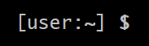
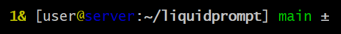

Default Theme
*************

.. contents::
   :local:

Preview
=======

If there is nothing special about the current context, the appearance of
Liquidprompt is similar to that of a default prompt:

If you are running a background command and are also in the "main" branch of a
Git repository on a server:

When Liquidprompt is displaying nearly everything (a rare event!), it may look
like this:

.. image:: default-long.png
   :alt: 🕤 ⌁24% ⌂1.68 θ90° 3d/2&/1z [user@server:~/ … /liquidprompt/docs/theme ⚞3] [pyenv] main(+10/-5,+3/-1)+* 20s 125 ±

See :ref:`Templates <templates>` for what each section will look like.

Configuration
=============

As the default theme, all of the normal :doc:`../config` are respected.

.. attribute:: LP_PS1_FILE
   :type: string
   :value: ""

   A template file that is sourced for each prompt. Must set :attr:`LP_PS1`.
   See :ref:`Templates <templates>` for details.

.. attribute:: LP_PS1
   :type: string
   :value: ""

   If set, the default theme sets :envvar:`PS1` to this value. Not very useful
   to set it in the config, instead set it in the :attr:`LP_PS1_FILE`.

.. _templates:

Templates
=========

The default theme supports templated sections. Each piece of the theme is saved
to a variable, and can be arranged in any order in a template. If you want to
change the theme enough to move things around, but not enough to make your own
theme, templates will let you change the order of the default theme's pieces.

As the default theme of Liquidprompt was the only theme until version 2.0,
templates were sometimes referred to as "themes" in version 1.X.

For a template file to be loaded, its filepath must be set in
:attr:`LP_PS1_FILE`.

A template file does nothing more than set :attr:`LP_PS1` to a value. The
following sections are available to be used.

An example template file is available: liquid.ps1_.

.. _liquid.ps1: https://github.com/nojhan/liquidprompt/blob/master/liquid.ps1

Template Sections
-----------------

All of the available template sections are listed below. Their order is the
default order if the user does not configure a different template.

.. note::
   Omitting a template section from your template will **not** disable that
   feature. While it will not be displayed in the prompt, Liquidprompt does not
   know that, and will still generate that template section. If you want to
   speed up your prompt by disabling a section, you must disable it with its
   respective ``LP_ENABLE_*`` option.

:attr:`LP_PS1_PREFIX`:

   Not actually a part of the default theme, it is used in the default template
   as the starting section. See :attr:`LP_PS1_PREFIX` and :func:`prompt_tag`
   for details.

.. attribute:: LP_TIME

   The current time, displayed as either numeric values or as an analog clock,
   depending on the value of :attr:`LP_TIME_ANALOG`. See :attr:`LP_ENABLE_TIME`.

.. attribute:: LP_BATT

   The current battery status:

   * a green ⏚ (:attr:`LP_MARK_BATTERY`) if charging, above the given threshold,
     but not charged
   * a yellow ⏚ if charging and under the given threshold
   * a yellow ⌁ (:attr:`LP_MARK_ADAPTER`) if discharging but above the given
     threshold
   * a red ⌁ if discharging and under the given threshold

   And if :attr:`LP_PERCENTS_ALWAYS` is enabled, also the current battery
   percent. See :attr:`LP_ENABLE_BATT`.

.. attribute:: LP_LOAD

   The average of the processors load, displayed with an intensity color map as
   load increases. See :attr:`LP_ENABLE_LOAD`.

.. attribute:: LP_TEMP

   The highest temperature of the available system sensors, displayed with an
   intensity color map as temperature increases. See :attr:`LP_ENABLE_TEMP`.

.. attribute:: LP_JOBS

   The number of detached sessions. See :attr:`LP_ENABLE_DETACHED_SESSIONS`.

   Also the number of running and sleeping shell jobs. See
   :attr:`LP_ENABLE_JOBS`.

.. attribute:: LP_BRACKET_OPEN

   An opening bracket, designed to go around the core of the prompt (generally
   user, host, current working directory). See :attr:`LP_MARK_BRACKET_OPEN`.

   If running in a terminal multiplexer, will be colored. See
   :attr:`LP_COLOR_IN_MULTIPLEXER`.

.. attribute:: LP_USER

   The current user, in bold yellow if it is root and in light white if it is
   not the same as the login user. See :attr:`LP_USER_ALWAYS`.

.. attribute:: LP_HOST

   A green ``@`` if the connection has X11 support; a yellow one if not.

   The current host – in bold red if you are connected via a ``telnet``
   connection and blue (or other unique colors) if connected via SSH. See
   :attr:`LP_HOSTNAME_ALWAYS`.

.. attribute:: LP_PERM

   A green colon (:attr:`LP_MARK_PERM`) if the user has write permissions in the
   current directory and a red one if not. See :attr:`LP_ENABLE_PERM`.

.. attribute:: LP_PWD

   The current working directory in bold, shortened if it takes too much space.
   See :attr:`LP_ENABLE_SHORTEN_PATH`.

.. attribute:: LP_DIRSTACK

   The size of the directory stack, prefixed with :attr:`LP_MARK_DIRSTACK`, all
   colored with :attr:`LP_COLOR_DIRSTACK`. Can be enabled by
   :attr:`LP_ENABLE_DIRSTACK`.

.. attribute:: LP_BRACKET_CLOSE

   A closing bracket, designed to go around the core of the prompt (generally
   user, host, current working directory). See :attr:`LP_MARK_BRACKET_CLOSE`.

   If running in a terminal multiplexer, will be colored. See
   :attr:`LP_COLOR_IN_MULTIPLEXER`.

.. attribute:: LP_SCLS

   The current Red Hat Software Collections environment. See
   :attr:`LP_ENABLE_SCLS`.

.. attribute:: LP_AWS_PROFILE

   The current active AWS Profile. See
   :attr:`LP_ENABLE_AWS_PROFILE`.

   .. versionadded:: 2.1

.. attribute:: LP_VENV

   The current Python (or Conda) virtual environment. See
   :attr:`LP_ENABLE_VIRTUALENV`.

.. attribute:: LP_RUBY_VENV

   The current Ruby virtual environment. See
   :attr:`LP_ENABLE_RUBY_VENV`.

   .. versionadded:: 2.1

.. attribute:: LP_TFSPACE

   The current Terraform workspace. See :attr:`LP_ENABLE_TERRAFORM`.

   .. versionadded:: 2.1

.. attribute:: LP_KUBECONTEXT

   The current Kubernetes context. See
   :attr:`LP_ENABLE_KUBECONTEXT`.

   .. versionadded:: 2.1

.. attribute:: LP_PROXY

   A ↥ (:attr:`LP_MARK_PROXY`) if an HTTP proxy is in use. See
   :attr:`LP_ENABLE_PROXY`.

.. attribute:: LP_VCS

   * The name of the current branch if you are in a version control repository
     (Git, Mercurial, Subversion, Bazaar, or Fossil):

      * in green if everything is up-to-date
      * in red if there are changes
      * in yellow if there are pending commits to push
   * The number of added/deleted lines if changes have been made and the number
     of pending commits
   * The number of commits ahead/behind the remote tracking branch
   * A yellow + (:attr:`LP_MARK_STASH`) if there are stashed modifications
   * a red \* (:attr:`LP_MARK_UNTRACKED`) if there are untracked files in the
     repository

.. attribute:: LP_RUNTIME

   The runtime of the last command, if it has exceeded a certain threshold. See
   :attr:`LP_ENABLE_RUNTIME`.

.. attribute:: LP_ERR

   The error code of the last command, if it is non-zero. See
   :attr:`LP_ENABLE_ERROR`.

:attr:`LP_MARK_PREFIX`

   Not actually a part of the default theme, it is used in the default template
   as the last thing before the prompt mark. See :attr:`LP_MARK_PREFIX` for
   details.

:attr:`LP_COLOR_MARK`

   Bold normally, red if you have ``sudo`` rights or for the root user.

   Separate from :attr:`LP_MARK` for historical reasons.

.. attribute:: LP_MARK

   A smart mark at the end of the prompt:

   * $ or % (:attr:`LP_MARK_DEFAULT`) for a simple user
   * # for the root user
   * ⌘ (:attr:`LP_MARK_FOSSIL`) for Fossil
   * ± (:attr:`LP_MARK_GIT`) for Git
   * ☿ (:attr:`LP_MARK_HG`) for Mercurial
   * ‡ (:attr:`LP_MARK_SVN`) for Subversion
   * ౠfor Git-Subversion
   * \|±\| (:attr:`LP_MARK_VCSH`) for VCSH

:attr:`LP_PS1_POSTFIX`

   Not actually a part of the default theme, it is used in the default template
   as the final section. See :attr:`LP_PS1_POSTFIX` for details.

