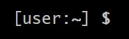
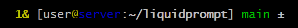
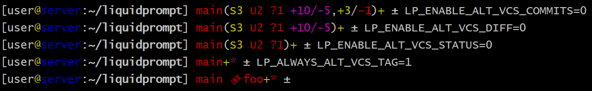

***************************
Alternate VCS Details Theme
***************************

The included ``themes/powerline/alternate_vcs.theme`` file includes a theme
extending the default theme but replacing the VCS details display.

.. contents::
   :local:

Alternate VCS
*************

The ``alternate_vcs`` theme is an extension of the default theme.

This prompt is a fully usable theme, designed to be more flexible than the
default theme in terms of what VCS information is shown in the prompt.

It is also an example of how to build a theme extending the default theme while
replacing one of the template sections.

.. versionadded:: 2.0

Preview
=======

If there is nothing special about the current context, the appearance of
Alternate VCS might be as simple as this:

If you are running a background command and are also in the "main" branch of a
Git repository on a server:

When Liquidprompt is displaying nearly everything, it may look like this:

A demo of what disabling the configuration options might look like:

Configuration
=============

Liquidprompt Configuration
--------------------------
All Liquidprompt config options are respected, **except for**:

* :attr:`LP_MARK_UNTRACKED` when :attr:`LP_ENABLE_ALT_VCS_STATUS` is enabled.

Theme Configuration
-------------------

Alternate VCS adds these config options:

Features
________

.. attribute:: LP_ALWAYS_ALT_VCS_TAG
   :type: bool
   :value: 0

   Determine when a matching VCS tag should be displayed:

   * ``0`` - Only when there is no current branch or bookmark
   * ``1`` - Always

.. attribute:: LP_ENABLE_ALT_VCS_COMMITS
   :type: bool
   :value: 1

   Display commits ahead or behind the remote tracking branch.

.. attribute:: LP_ENABLE_ALT_VCS_DIFF
   :type: bool
   :value: 1

   Display the number of changed lines.

.. attribute:: LP_ENABLE_ALT_VCS_STATUS
   :type: bool
   :value: 1

   Display the number(s) of changed files, of type staged (if VCS supports
   staging), non-staged (or non-committed if no staging), and untracked.

   If disabled, a marker will be added to the end of the display to show if
   there are untracked files (the behavior of the default theme).

Markers
_______

.. attribute:: LP_MARK_ALT_VCS_TAG
   :type: string
   :value: "🔖"

   The marker string used to indicate the following string is a VCS tag.

