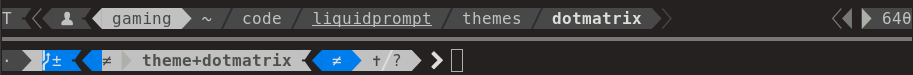
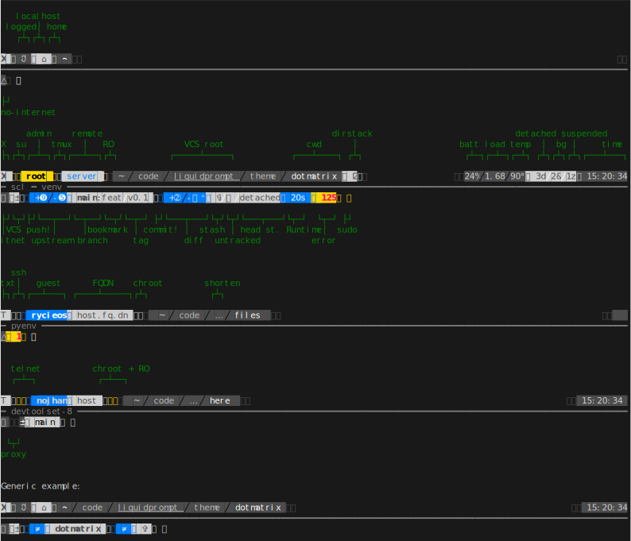

DotMatrix Theme
***************

The included ``themes/dotmatrix/dotmatrix.theme`` file defines an original theme design,
that will completely changes the way you imagine the prompt.

It is focused on *improving the user experience*,
by vastly improving the ability of the user to immediatly spot
what she should do following her system's state changes.

Has such, you may find it a little bit disconcerting at first.
But we believe that the advantages of this design makes it worth the effort.

.. contents::
   :local:

Overview
========

If there is nothing special about the current context, the appearance of
DotMatrix might be as simple as this:

A typical display of a slightly complex session would look like this:

The DotMatrix theme also comes as several variants, changing the shape of the segments separators,
like the (default) "dotmatrix" pixels:

.. image:: dotmatrix-short-dots.png

or the "slant" variant:

Design
======

Rationale
---------

The DotMatrix theme use a couple of design principles:

* It is accessible to colorblind people, hence it uses:
    * only four colors: dark grey, white, blue and yellow.
    * At least a text item for each segment,
    * or a blank space between segments.
* The blue colors means that the user is probably expected to perform some task.
* The yellow color carries an error or something of concern.
* Segments for "default" state are joined with graphical symbols that reads from right to left,
  in a way that makes sense.
* It uses three ways to carry information about the state of the system:
    * Important states are denoted by text.
    * Ancillary states can be shown with a single character/icon.
    * States appearing from a user action can be shown by "detaching" two segments usually joined.
      When possible, this added space is shown as having a right-to-left direction.

The prompt itself is designed in three lines:

- The first line shows the state of the shell itself (type of graphical server, remote connection, user, host, path, etc.) on the left,
  and optional sensors states on the right (temperature, jobs, time, etc.).
- The second line displays whatever keywords have a meaning in the context (virtual environments, software collections, etc.).
- The third line indicates the relationships toward extern services (internet, VCS) and immediate status (runtime, error code).
  This is also where the actual prompt is.

Example
-------

For instance, in the following prompt, you can see that the user is in a Git repository and has some action waiting to be done:
- the rightmost blue "≠" indicates that there are some modifications waiting to be commited (hence the directional hint, from a diff to the branch).
- the leftmost blue segment indicates that there are some commits that may be pushed to the remote (hence the directional hint, from the branch to the VCS symbol).

The screenshot also shows that the last command ended in an error, hence the red-over-yellow error code.

The upper section shows a classical state of the prompt: a shell within a graphical server ("X"),
for the default login user (""), on localhost (""), in the liquidprompt directory, which is underlined because it is also a VCS repository.

Full description
----------------

The following diagram shows almost all the possible states of a DotMatrix Liquid Prompt:

Setup
=====

.. versionadded:: 2.1.3

To actually use the DotMatrix theme, you need to add a few configuration commands to the script that loads the Liquid Prompt.
For example:

.. code-block:: bash

   # Load the Liquid Prompt.
   source ~/.liquidprompt
   # Configure the desired variant.
   DOTMATRIX_VARIANT="chevron"
   # Load the theme.
   source ~/code/liquidprompt/themes/dotmatrix/dotmatrix.theme && lp_theme dotmatrix

.. note:: The recommended segment markers (the "chevron" variant) uses characters in the private section of unicode
          that are defined by the "Nerd-fonts" project.
          You will either need a compatible font, or use a variant that does not need them, like "text" and "dotmatrix".

          See the `Nerd-fonts Fonts installation docs`_ for help on installing this kind of fonts.

.. _`Nerd-fonts fonts installation docs`: https://www.nerdfonts.com/

Variants
--------

Variants needing a Nerd-fonts font:

- "chevron" (the recommended one),
    .. image:: dotmatrix-short-chevron.png
- "round",
    .. image:: dotmatrix-short-round.png
- "slant".
    .. image:: dotmatrix-short-slant.png

Variants available with a regular font:

- "dotmatrix" (the default),
    .. image:: dotmatrix-short-dots.png
- "text" (using only common characters).
    .. image:: dotmatrix-short-text.png

Configuration
=============

Liquid Prompt Configuration
---------------------------

The DotMatrix theme honors the Liquid Prompt configuration options,
except for the ones defining colors, specific marks and disabling some features.

The following options are honored:

- :attr:`LP_ENABLE_PERM`,
- :attr:`LP_ENABLE_VCS_DIFFSTATS`,
- :attr:`LP_ENABLE_UNCOMMITED`,
- :attr:`LP_MARK_BATTERY`,
- :attr:`LP_MARK_LOAD`,
- :attr:`LP_MARK_TEMP`,
- :attr:`LP_PS1_PREFIX`.

The following options are **not honored**:

- every `LP_COLOR_\*` options.
- all the others `LP_MARK_\*` options not listed in the above section.
- :attr:`LP_USER_ALWAYS` (at least a user icon is always displayed).

Theme Configuration
-------------------

High-level
__________

.. attribute:: DOTMATRIX_VARIANT
   :type: string
   :value: "dotmatrix"

   The variant of the theme.
   This mainly change the segments separation style,
   but can also impact the icons on some variants.

   Allowed values:

   - "dotmatrix" (the *default*),
   - "chevron" (the *recommended*, need a Nerd-fonts font),
   - "slant" (need a Nerd-fonts font),
   - "round" (need a Nerd-fonts font),
   - "text" (the one that works anywhere).

.. attribute:: DOTMATRIX_SPACED
   :type: boolean
   :value: 1

   If set to false, this flag will configure a compact prompt,
   showing segments without extra spaces around their joints.

Example of a spaced prompt:

Example of a compact prompt:

Generic Markers
_______________

The following options configure some marks that will be used across all variants of the theme.

.. attribute:: DOTMATRIX_DISPLAY_TEXT
   :type: string
   :value: "T"

   The marker used to indicates that the shell is in text mode,
   i.e. that does not have a graphical display
   (more rigorously: there is no X11 `DISPLAY` environment variable).

.. attribute:: DOTMATRIX_DISPLAY_X11
   :type: string
   :value: "X"

   The marker used to indicates that the shell does have access to a graphical server
   (more rigorously: there is a X11 `DISPLAY` environment variable).

.. attribute:: DOTMATRIX_HOST_LOCAL
   :type: string
   :value: "⌂"

   The marker used to indicate that the hostname is `localhost`.

.. attribute:: DOTMATRIX_USER_LOCAL
   :type: string
   :value: "♟"

   The marker used to indicate that the user is the same than the login one.

.. attribute:: DOTMATRIX_MARK_STASH
   :type: string
   :value: "✝"

   The marker used to indicate that the VCS stash is not empty.

.. attribute:: DOTMATRIX_MARK_UNTRACKED
   :type: string
   :value: "?"

   The marker used to indicate that there are some files that are untracked
   by the VCS in the current repository.

.. attribute:: DOTMATRIX_DIFF
   :type: string
   :value: "≠"

   The marker used to indicate that there is some change in the VCS state
   (either changes needed to be committed, or commits needed to be pushed).

.. attribute:: DOTMATRIX_VCS
   :type: string
   :value: "╟┘"

   The marker used to indicate that there is a VCS involved in the current directory.

.. attribute:: DOTMATRIX_MARK
   :type: string
   :value: "■"

   The actual prompt marker, right where the user type text.

Variant Markers
_______________

These options are the one used to actually define the theme variants.
You may overcome them with your own configuration.

.. attribute:: DOTMATRIX_LINE
   :type: string
   :value: "━"

   The character used to draw the middle line.

.. attribute:: DOTMATRIX_PLUG
   :type: string
   :value: "▛"

   The character for joined segments limits.

.. attribute:: DOTMATRIX_SOFT
   :type: string
   :value: "╱"

   The character for "soft" separation (e.g. path elements, branch details, jobs, etc.)

.. attribute:: DOTMATRIX_MEAN
   :type: string
   :value: "▞"

   The character for "mean" separation
   (used when two segments of the same color are joint).

.. attribute:: DOTMATRIX_LINK
  :type: array<string>
  :value: ("▙" " "   "▜")

  Characters used for showing a small gap.

.. attribute:: DOTMATRIX_OPEN
  :type: array<string>
  :value: ("▙" " ▚ " "▜")

  Characters used for showing a large gap.

.. attribute:: DOTMATRIX_DANG
  :type: array<string>
  :value: ("▙" " □ " "▜")

  Characters used for showing a very lareg gap (i.e. a dangerous state).

.. attribute:: DOTMATRIX_ENDS
  :type: array<string>
  :value: ("▛▞▗ ▝" "▖ ▘▞▟")

  Characters marking the ends of the right and left parts of the first line.

.. attribute:: DOTMATRIX_ITEMS
  :type: array<string>
  :value: ("┫" "┃" "┣")

  Characters used to separate keywords in the middle line.
  The middle character separates keywords of the same type (e.g. every Software Collection).

Spacing
_______

You may overcome the spacing details with these options.

.. attribute:: DOTMATRIX_SPACE_VOID
   :type: string
   :value: " "

   Spacing character around segments joints marker.

.. attribute:: DOTMATRIX_SPACE_PATH
   :type: string
   :value: " "

   Spacing character specifically for the "current path" section.

.. attribute:: DOTMATRIX_SPACE_FIELD
   :type: string
   :value: ""

   Spacing character around the content of the segments themselves.

.. attribute:: DOTMATRIX_SPACE_LINE
   :type: string
   :value: " "

   Spacing character around the keywords of the middle line.

.. attribute:: DOTMATRIX_SPACE_FILL
   :type: string
   :value: "█"

   Spacing character for filled sections.
   You probably don't want to touch this.

Colors
______

.. attribute:: DOTMATRIX_COLOR_DARK
   :type: array<int>
   :value: (252 239 0 0  15   0)

   The color of dark segments.

.. attribute:: DOTMATRIX_COLOR_LITE
   :type: array<int>
   :value: (239 252 0 0   0  15)

   The color of light segments.

.. attribute:: DOTMATRIX_COLOR_GLOW
   :type: array<int>
   :value: (  0 252 1 0   0  15)

   The color for bright elements.

.. attribute:: DOTMATRIX_COLOR_NOTE
   :type: array<int>
   :value: ( 15  33 0 0  15  12)

   The color for notable elements.

.. attribute:: DOTMATRIX_COLOR_WARN
   :type: array<int>
   :value: (196 220 1 0   0  11)

   The color for elements related to a warning.

.. attribute:: DOTMATRIX_COLOR_FAIR
   :type: array<int>
   :value: (  0 244 0 0   0   8)

   The color for elements that are not very important.

.. attribute:: DOTMATRIX_COLOR_PATH_SHORT
   :type: array<int>
   :value: (252 239 0 0   0  15)

   The color of the shorten path marker.

.. attribute:: DOTMATRIX_COLOR_PATH_VCS
   :type: array<int>
   :value: (252 239 0 1   0  15)

   The color of the VCS repository in the path.

.. attribute:: DOTMATRIX_COLOR_PATH_LAST
   :type: array<int>
   :value: (15 239 1 0   0  15)

   The color of the current directory.

.. attribute:: DOTMATRIX_COLOR_LINE
   :type: array<int>
   :value: (244 -1 0 0 15 -1)

   The color of the middle line.

.. attribute:: DOTMATRIX_COLOR_MARK
   :type: array<int>
   :value: (15 -1 0 0 15 -1)

   The color of the actual prompt mark.

.. attribute:: DOTMATRIX_COLOR_SEP_DARK
   :type: array<int>
   :value: (  0 -2 0 0  0 -2)

   The color for dark separators.

.. attribute:: DOTMATRIX_COLOR_SEP_FAIR
   :type: array<int>
   :value: (244 -2 0 0  0 -2)

   The color for fair separators.

.. attribute:: DOTMATRIX_COLOR_SEP_LITE
   :type: array<int>
   :value: ( 15 -2 0 0 15 -2)

   The color for light separators.

