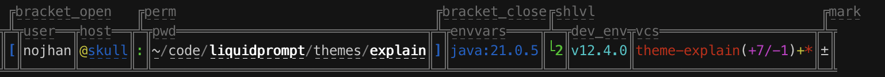

*************
Explain Theme
*************

The included ``themes/explain/explain.theme`` file includes a theme that
add a label to each section of the default theme, along with a clickable link
to the corresponding documentation.

.. contents::
   :local:

Explain
*******

The *explain* theme displays the default theme, surrounded by boxes on each
section of the prompt, along with a label showing the name of the section.
The section name holds an hyperlink to the latest online documentation about
the section.

.. versionadded:: 2.3

Preview
=======

The default configuration surround each section with its own border,
which can make a quite long prompt if you have several sections displayed:

For convenience, the prompt mark is duplicated on a new line,
after the explained prompt.

The prompt will take at least 3 rows to be displayed,
but can go up to five rows if there are several short sections that are
close to each other.

Presets
=======

The ``themes/explain/`` directory comes with several presets for changing the
look of the border. You can source the corresponding files to use them.

Using ``themes/explain/preset-top.conf`` (get rid of the bottom border,
and thus takes only up to four rows):

.. image:: explain-top.png

The following presets use single borders, and thus are less long
than the default.

Using ``themes/explain/preset-bold.conf``:

Using ``themes/explain/preset-double.conf``:

Using ``themes/explain/preset-square.conf``:

The ``themes/explain/preset-chevrons.conf`` preset requires a font supporting
"Box Drawings Diagonal" characters (approved as part of Unicode version 1.1
in 1993):

Configuration
=============

Liquid Prompt configuration
---------------------------

The LP_ENABLE_HYPERLINKS configuration variable should be set to 1 for the
hyperlinks to be active, if the terminal emulator supports them. They will
usually be displayed as a dotted underline under the section label name, and
a mouse click is usually needed to open the Web browser on the Liquid Prompt
documentation page about the default theme, at the anchor of the section.

Unless explicitly disabled, *explain* will enable LP_ENABLE_HYPERLINKS.
If disabled, no hyperlink to the documentation will be inserted, and only the
sections label names will be displayed.

Section names are the lowercase version of the default prompt's section
variable, without its ``LP_`` prefix. E.G.: a label reading "bracket_open"
points to the variable ``LP_BRACKET_OPEN``, as documented on the following page:
https://liquidprompt.readthedocs.io/en/stable/theme/default.html

Unless explicitly set, *explain* will set LP_MARK_PREFIX as a single newline.
If you use your own configuration, you probably want to add a newline in it too,
because a prompt with surrounding characters may become quite long.

The *explain* theme removes the following Liquid Prompt marks:

- ``LP_MARK_DEV_OPEN``
- ``LP_MARK_DEV_CLOSE``
- ``LP_MARK_DEV_MID``
- ``LP_MARK_MODULES_OPEN``
- ``LP_MARK_MODULES_SEP``
- ``LP_MARK_MODULES_CLOSE``
- ``LP_MARK_ENV_VARS_OPEN``
- ``LP_MARK_ENV_VARS_SEP``
- ``LP_MARK_ENV_VARS_CLOSE``

Theme configuration
-------------------

.. attribute:: LP_EXPLAIN_COLOR
   :type: color
   :value: 241 (light grey foreground)

   The color of everything surrounding the actual prompt.

.. attribute:: LP_EXPLAIN_MARK_TOP
   :type: string
   :value: ╮╭

   The character(s) used for the separation between two sections
   on the row on top of the actual prompt.

.. attribute:: LP_EXPLAIN_MARK_MID
   :type: string
   :value: ││

   The character(s) used for the separation between two sections
   on the actual prompt row.

.. attribute:: LP_EXPLAIN_MARK_BOTTOM
   :type: string
   :value: ╯╰

   The character(s) used for the separation between two sections
   on the row after the actual prompt.

.. attribute:: LP_EXPLAIN_MARK_BODY_TOP
   :type: string
   :value: ─

   The character(s) used to fill the row on top above section.

.. attribute:: LP_EXPLAIN_MARK_BODY_BOTTOM
   :type: string
   :value: ─

   The character(s) used to fill the row below each section.

.. attribute:: LP_EXPLAIN_MARK_JOINT
   :type: string
   :value: ┴

   The character(s) used to start an edge toward a label put on top row(s),
   when there is no room to put the label on the row above the actual prompt.

.. attribute:: LP_EXPLAIN_MARK_ELBOW
   :type: string
   :value: ╭

   The character(s) used to finish an edge toward a label put on top row(s),
   when there is no room to put the label on the row above the actual prompt.

