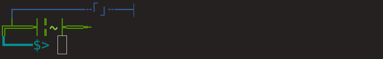

**********
Neon Theme
**********

The included ``themes/neon/neon.theme`` file includes a theme
based on the default theme but on three lines and
with a more pronounced color scheme.

.. contents::
   :local:

Neon
****

The ``neon`` theme is an extension of the default theme,
featuring a "techno-ascii-art" style.

This prompt is a fully usable theme, designed to be easier
to visually parse than the default theme.

It is also an example of how to build a theme modifiyng
colors and structure of the sections.

The theme features three rows:

#. the first one hosting "secondary" information, in blue (jobs, sensors, dev context, etc.),
#. the second row displays "primary" information (user, path, VCS, etc.), in green,
#. the third one is dedicated to the prompt (runtime, error code, prompt mark), in cyan.

Within each row, important notice are displayed in bold
(and thus probably in a slightly lighter color, depending on your terminal configuration).

.. versionadded:: 2.2

Preview
=======

If there is nothing special about the current context:

If you are running some command in a Git repository:

When Liquid Prompt is displaying a lot of things, it may look like this:

.. image:: neon-long.png

Configuration
=============

The Neon theme require a font having the Unicode "box drawing" characters
(almost any modern font should work).

Liquid Prompt Configuration
---------------------------

All Liquid Prompt config options are respected, **except for**:

* All ``LP_COLOR_*`` variables,
* :attr:`LP_MARK_PREFIX`,
* :attr:`LP_PS1_POSTFIX`,
* :attr:`LP_MARK_MULTIPLEXER_OPEN` (superseeded by :attr:`NEON_MARK_MULTIPLEXER_OPEN`),
* :attr:`LP_MARK_MULTIPLEXER_CLOSE` (superseeded by :attr:`NEON_MARK_MULTIPLEXER_CLOSE`),
* :attr:`LP_MARK_PERM` (superseeded by :attr:`NEON_MARK_PERM`),
* :attr:`LP_MARK_SHORTEN_PATH` (superseeded by :attr:`NEON_MARK_SHORTEN_PATH`),
* :attr:`LP_MARK_DIRSTACK` (superseeded by :attr:`NEON_MARK_DIRSTACK`),
* :attr:`LP_MARK_SHLVL` (superseeded by :attr:`NEON_MARK_SHLVL`),
* :attr:`LP_MARK_JOBS_SEPARATOR` (superseeded by :attr:`NEON_MARK_JOBS_SEPARATOR`),
* :attr:`LP_MARK_WIFI` (superseeded by :attr:`NEON_MARK_WIFI`),
* :attr:`LP_MARK_BRACKET_OPEN` (superseeded by :attr:`NEON_MARK_BRACKET_OPEN`),
* :attr:`LP_MARK_BRACKET_CLOSE` (superseeded by :attr:`NEON_MARK_BRACKET_CLOSE`).

Theme Configuration
-------------------

Neon adds the following config options.

Colors
______

.. attribute:: NEON_PRIMARY_COLOR
   :type: array<int>
   :value: (.)

   Color used for the "primary" row.

.. attribute:: NEON_PRIMARYBOLD_COLOR
   :type: array<int>
   :value: (2 -1 1 0 2 -1)

   Color used for important info in the primary row.

.. attribute:: NEON_SECONDARY_COLOR
   :type: array<int>
   :value: (4 -1 0 0 4 -1)

   Color used for the "secondary" row.

.. attribute:: NEON_SECONDARYBOLD_COLOR
   :type: array<int>
   :value: (4 -1 1 0 4 -1)

   Color used for important info in the secondary row.

.. attribute:: NEON_PROMPT_COLOR
   :type: array<int>
   :value: (6 -1 0 0 6 -1)

   Color used for the "prompt" row.

.. attribute:: NEON_WARN_COLOR
   :type: array<int>
   :value: (1 -1 0 0 1 -1)

   Color used for warning-related info, in all rows.

Markers
_______

.. attribute:: NEON_MARK_BRACKET_OPEN
   :type: string
   :value: "┥"

   Marker used as a value for :attr:`LP_MARK_BRACKET_OPEN`.

.. attribute:: NEON_MARK_BRACKET_CLOSE
   :type: string
   :value: "┝"

   Marker used as a value for :attr:`LP_MARK_BRACKET_CLOSE`.

.. attribute:: NEON_MARK_MULTIPLEXER_OPEN
   :type: string
   :value: "╣"

   Marker used as a value for :attr:`LP_MARK_MULTIPLEXER_OPEN`.

.. attribute:: NEON_MARK_MULTIPLEXER_CLOSE
   :type: string
   :value: "╠"

   Marker used as a value for :attr:`LP_MARK_MULTIPLEXER_CLOSE`.

.. attribute:: NEON_MARK_PERM
   :type: string
   :value: "╏"

   Marker used as a value for :attr:`LP_MARK_PERM`.

.. attribute:: NEON_MARK_SHORTEN_PATH
   :type: string
   :value: "┈"

   Marker used as a value for :attr:`LP_MARK_SHORTEN_PATH`.

.. attribute:: NEON_MARK_DIRSTACK
   :type: string
   :value: "☰"

   Marker used as a value for :attr:`LP_MARK_DIRSTACK`.

.. attribute:: NEON_MARK_SHLVL
   :type: string
   :value: ""

   Marker used as a value for :attr:`LP_MARK_SHLVL`.

.. attribute:: NEON_MARK_JOBS_SEPARATOR
   :type: string
   :value: "┄"

   Marker used as a value for :attr:`LP_MARK_JOBS_SEPARATOR`.

.. attribute:: NEON_MARK_WIFI
   :type: string
   :value: "╜"

   Marker used as a value for :attr:`LP_MARK_WIFI`.
