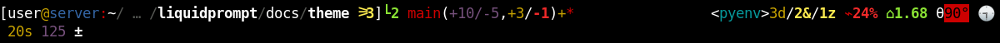

************
Unfold Theme
************

The included ``themes/unfold/unfold.theme`` file includes a theme
reformatting the default theme to spread it on two lines,
with a part of the first line being right-aligned.

.. contents::
   :local:

Unfold
******

The ``unfold`` theme is an reconfiguration of the default theme's structure.

This prompt is a fully usable theme, designed so that:

- The prompt location is more stable (on the second line).
- There is a clearer hierarchy between important data
  (display on the first line, left side),
  and less important information (first line, right side).

It is also an example of how to rearrange the prompt's template sections,
without touching anything else.

As such, all the configuration of the default theme is honored.

.. versionadded:: 2.2

Preview
=======

If there is nothing special about the current context, the appearance of
Alternate VCS might be as simple as this:

If you are running a background command and are also in the "main" branch of a
Git repository on a server:

.. image:: unfold-med.png

When Liquid Prompt is displaying nearly everything, it may look like this:

